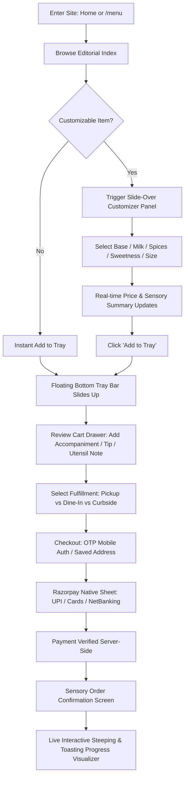
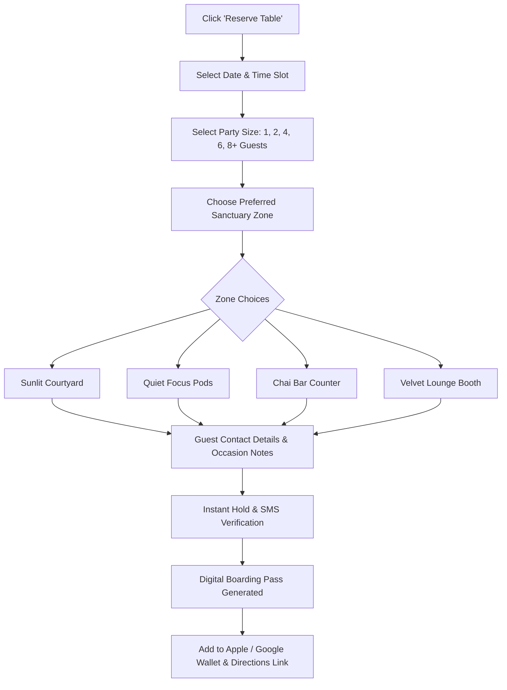
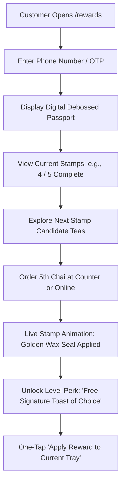
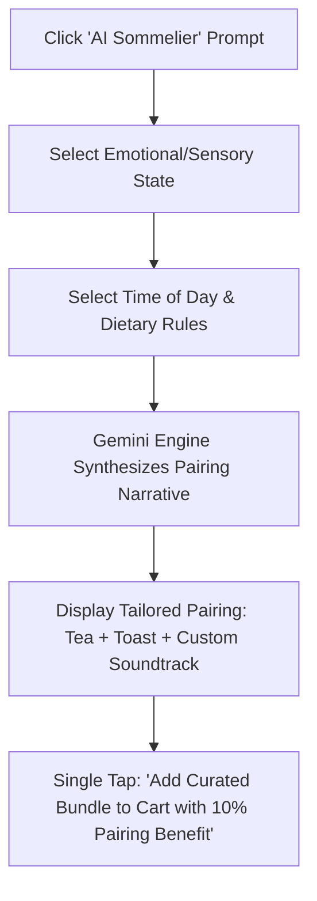

# TEA TOAST — Complete UX Architecture & Product Specification
**Tagline:** *"Sip. Toast. Talk. Repeat."*  
**Design Philosophy:** *Premium + Minimal + Warm + Cinematic + Modern Indian Cafe*  
**Document Version:** 1.0.0 • Architecture & Strategy Phase  
**Author:** Senior Product Designer & Digital Experience Architect  

---

## Executive Summary & Creative Direction

Tea Toast is conceived not as a standard transactional restaurant website or food-delivery app clone, but as a **digital flagship and cultural salon** for contemporary Indian tea culture. 

Drawing aesthetic and UX benchmarks from luxury culinary editorial platforms (such as *Aesop*, *Dishoom*, *Blue Bottle Kyoto*, and *Kinfolk*), the platform synthesizes rich sensory storytelling with frictionless commerce. It honors the ritual of the Indian *chai tapri* and Irani cafe heritage while reframing it through an exacting modern design vocabulary: disciplined typography, generous negative space, warm tactile palettes, and scroll-driven cinematic pacing.

---

## 1. Complete Sitemap

```
TEA TOAST WEB ARCHITECTURE
│
├── / (Homepage — Flagship Narrative Scroll)
│   ├── #hero (Cinematic Video/Still Banner & Live Status)
│   ├── #manifesto (Brand Statement & Philosophy)
│   ├── #signatures (Curated Seasonal Signatures)
│   ├── #experience (5-Step Scroll-Driven Chai Ritual)
│   ├── #build-chai (Interactive Visual Configurator)
│   ├── #cafe-moods (Atmospheric Shift Matrix: Morning to Late Night)
│   ├── #the-sanctuary (Architectural & Culinary Atmosphere)
│   ├── #events-ticker (Cultural Calendar & Gatherings)
│   ├── #passport (Tea Passport Loyalty Hook)
│   ├── #sommelier (AI Mood-to-Pairing Engine)
│   ├── #locations (Store Locator, Hours & Live Seating)
│   └── #footer (Colophon, Navigation, Certifications)
│
├── /menu (Editorial Tasting Index)
│   ├── ?category=tea
│   ├── ?category=toast
│   ├── ?category=snacks
│   ├── ?category=desserts
│   ├── ?category=combos
│   └── /menu/[slug] (Deep Product Page with Allergen & Origin Story)
│
├── /order (Online Ordering & Pickup / Delivery Engine)
│   ├── /order/checkout (Frictionless 2-Step Payment & Address)
│   ├── /order/confirmation/[order_id] (Order Receipt & Receipt Card)
│   └── /order/track/[order_id] (Live Sensory Brewing & Toasting Tracker)
│
├── /reserve (Table & Experience Booking)
│   ├── /reserve/floorplan (Interactive Seating Zone Selector)
│   └── /reserve/confirmation/[res_id] (Calendar Pass & SMS Pass)
│
├── /experience (Deep Brand & Architectural Journey)
│   ├── /experience/brewing (The Science of Assam CTC & Whole Spices)
│   └── /experience/baking (The Sourdough & Milk Bread Bakery)
│
├── /rewards (Tea Passport Loyalty Portal)
│   ├── /rewards/passport (Digital Stamp Card & Tier Milestones)
│   └── /rewards/redeem (Point Exchange Catalogue)
│
├── /events (Cultural Programming & Community)
│   ├── /events/[event_slug] (Event Detail & Seat RSVP)
│   └── /events/host (Private Gatherings & Salon Inquiries)
│
├── /about (Brand Heritage, Sourcing & Founders)
├── /contact (Press, Careers, Partnerships & Direct Inquiries)
│
└── [Global Drawers & Modals]
    ├── [Drawer] Quick-View Product Customizer
    ├── [Drawer] Tactile Slide-Over Cart & Order Summary
    ├── [Modal] AI Sommelier Mood Selector
    └── [Modal] Auth / OTP One-Tap Login
```

---

## 2. Page Hierarchy & Deep Section Architecture

### 2.1 Homepage Breakdown (12 Distinct Narrative Blocks)

#### Section 01 — The Flagship Hero
* **Concept:** Atmospheric cinematic opening. Ambient video loop of slow-motion spiced tea streaming into fluted terracotta porcelain, backlit by early morning golden haze.
* **Layout:** Asymmetric full-bleed composition (`100vh`). The visual dominates the right-center canvas, while high-contrast editorial type anchors the left.
* **Typography:**
  * Eyebrow: `TEA TOAST CAFE — EST. 2026 • ROASTERY & BAKERY` (12px, Manrope, Monospace tracking +0.15em)
  * Display Headline: 
    > *"YOUR DAILY*  
    > *CUP OF CHAOS."*  
    *(Instrument Serif, clamp(3.5rem, 8vw, 7.5rem), italicized "CHAOS")*
  * Sub-copy: *"Tea, toast and conversations worth staying for."* (18px, Inter, warm stone tint)
* **CTAs:**
  * Primary: `ORDER PICKUP & DELIVERY` (Solid Deep Green pill, roasted orange hover glow)
  * Secondary: `EXPLORE THE MENU` (Ghost pill with subtle 1px hairline border in toasted gold)
* **Metadata Badge (Live Status):** Top-right floating glass pill with glowing emerald pulse: `● OPEN TODAY • 8:00 AM — 10:00 PM • LIVE TABLE AVAILABILITY: HIGH`.

#### Section 02 — The Brand Manifesto
* **Concept:** An intentional drop in kinetic tempo. Deep negative space that forces the reader to breathe and absorb the cafe's culinary premise.
* **Layout:** Centered 8-column editorial column framed by 40% vertical whitespace.
* **Typography:** 
  > *"Some moments deserve to be brewed slowly."*  
  *(Playfair Display / Instrument Serif, 48px, line-height 1.15)*
* **Copy:** 
  *"We believe chai is not a commodity swallowed on the run. It is an everyday liturgy. Hand-crushed ginger, whole green cardamom from Idukki, bold single-estate Assam CTC, and artisanal bread toasted to golden-crusted perfection over cultured butter. Welcome to your third place."*
* **Design Detail:** A delicate 1px vertical hairline divider that draws the scroll down into the signature offerings.

#### Section 03 — The Curated Signatures
* **Concept:** Anti-grid presentation of the 4 flagship house pairings.
* **Composition:** Staggered editorial columns with alternating vertical offsets (Item 01 left-aligned low, Item 02 right-aligned high, Item 03 left-centered, Item 04 full-width spotlight).
* **The 4 Anchors:**
  1. **OG Masala Chai:** Single-estate Assam, crushed black ginger, Munnar cardamom, steamed organic whole milk. `₹49`
  2. **Three-Cheese Chilli Toast:** Aged English cheddar, mozzarella, spiced Bhavnagri chillies, rustic pullman loaf. `₹189`
  3. **Choco Crunch Toast:** 70% dark Malabar chocolate ganache, roasted hazelnut feuilletine, toasted milk brioche. `₹210`
  4. **The Tea Toast Platter:** Two artisanal cutting chais, duo of heritage toasts, and warm spiced maska bun. `₹320`
* **Interaction:** 
  * Hovering an item triggers a magnetic cursor morph to `VIEW FLAVOR` with subtle 3D parallax tilt on the culinary imagery.
  * Direct one-tap `+ QUICK ADD` pops a lightweight bottom drawer configurator without navigating away.

#### Section 04 — The Tea Experience (Scroll-Driven Choreography)
* **Concept:** Pinned viewport horizontal scroll explaining the 5 sacred stages of craft.
* **Sequence:**
  * `01 / CHOOSE YOUR LEAF` — Sourcing single-estate Assam orthodox & CTC harvest.
  * `02 / CRUSH & INFUSE` — Mortar-pestle fresh ginger root and green pod cardamom.
  * `03 / TEMPER THE HEAT` — Rolling boil aeration, unlocking deep amber tannins.
  * `04 / SWEETEN WITH INTENTION` — Raw deshi khand, organic jaggery, or sugar-free.
  * `05 / TAKE YOUR TIME` — Poured from height into double-walled grooved clay porcelain.
* **UX Nuance:** Smooth scrubbing bar indicating progress (`01 / 05`) with tactile audio feedback toggle (whispering ambient boiling / sizzle sounds).

#### Section 05 — "Build Your Chai" Interactive Studio
* **Concept:** Tactile virtual chai customizer delivering gamified brand joy and direct cart conversion.
* **Interface Architecture:**
  * **Left Canvas (60%):** Photorealistic interactive SVG/Canvas vessel that reflects user choices in real time (liquid color deepens with spices, steam density shifts, milk froth layer responds to dairy selection).
  * **Right Control Console (40%):** Segmented tactile selectors:
    * *Base:* Assam CTC / Darjeeling First Flush / Kashmiri Kahwa Green / Vegan Oat Blend
    * *Infusions:* Fresh Crushed Ginger / Cardamom Pod / Clove & Cinnamon / Saffron Strands
    * *Sweetness:* Zero Sugar / Half Spoon / Desi Khand / Palm Jaggery
    * *Vessel & Size:* Kulhad Clay (200ml) / Glass Cutting (150ml) / Double Steep Mug (350ml)
  * **Persistent Bottom Summary:**
    * Live readout: `YOUR CHAI: Masala + Fresh Ginger • Medium • Desi Khand • Kulhad`
    * Real-time tally: `₹69`
    * CTA: `ADD MY CUSTOM BREW TO ORDER`

#### Section 06 — The Cafe Mood Matrix
* **Concept:** Dynamic mood toggle that shifts the cafe's persona based on time and intention.
* **Moods:** `MORNING RITUAL` | `WORK & DEEP FOCUS` | `FRIENDS & CHATTER` | `FAMILY EVENING` | `LATE NIGHT SANCTUARY`
* **UX Transformation:** Clicking a mood dynamically filters the curated food pairings, reveals relevant amenities (e.g., high-speed Wi-Fi & silent power pods for *Work*, board games and sharing platters for *Friends*), and alters the ambient photography tone.

#### Section 07 — The Physical Sanctuary (Architectural Walkthrough)
* **Concept:** Photographic homage to the physical store.
* **Layout:** Masonry editorial spread with architectural details: textured lime-wash terracotta walls, brass chai kettles, fluted timber counters, warm ambient pendants, and courtyard greenery.
* **Micro-details:** Floating hot-spots on images: click on "The Chai Bar" to see barista notes; click on "The Reading Nook" to inspect the cafe library catalogue.

#### Section 08 — Cultural Calendar & Events
* **Concept:** Minimalist typographic horizontal ledger of upcoming community programming.
* **List Architecture:**
  * `OCT 14` — *The Acoustic Chai Sessions: Indie Folk by Kabir* (8:00 PM • 35 Seats)
  * `OCT 18` — *Typography & Chai: Creative Scribes Meetup* (5:00 PM • 20 Seats)
  * `OCT 22` — *Sunday Board Games & Endless Toast Tournament* (11:00 AM • Open)
* **Action:** Direct `RSVP & RESERVE SEAT` slide-over modal.

#### Section 09 — The Tea Passport (Gamified Loyalty)
* **Visual Identity:** Styled like a physical, debossed leather-and-parchment passport.
* **Mechanism:** 
  > *"TRY 5 TEAS. UNLOCK YOUR SIXTH COMPLIMENTARY."*
* **Interactive Element:** 6 circular stamp slots. Visitors can click through 5 interactive tea cards to preview their digital passport stamp lock status. Shows immediate reward ROI.

#### Section 10 — AI Chai Sommelier ("What Are You Feeling Today?")
* **Concept:** Playful, intelligent conversational recommendation engine.
* **Interaction:** Single-click emotional prompt chips:
  * `⚡ ENERGETIC` → Recommends *Kadak Black Masala + Spicy Cheese Chilli Toast*
  * `🌧️ COMFORT` → Recommends *Adrak Elaichi Chai with Jaggery + Maska Bun*
  * `🌿 RELAXED` → Recommends *Kahwa Green Tea with Almond Slivers + Honey Cinnamon Toast*
  * `🎯 FOCUSED` → Recommends *Double-Brew Black Tea + Garlic Butter Sourdough*
  * `🚀 ADVENTUROUS` → Recommends *Saffron Karak + Choco Crunch Toast*
* **Output:** Instant pairing card with story snippet and `ADD BUNDLE TO TRAY (10% OFF)`.

#### Section 11 — The Sanctuary Finder (Location & Hospitality Concierge)
* **Components:**
  * Address & Interactive Stylized Vector Map (custom parchment/green map styling)
  * Live status: Current waiting time / peak hours graph
  * Parking valet availability & nearest metro/transit routes
  * Quick Actions: `GET MAP DIRECTIONS`, `CALL CONCIERGE`, `RESERVE TABLE NOW`

#### Section 12 — The Colophon Footer
* **Layout:** Monolithic deep roasted dark brown (`#241C18`) foundation with warm cream typography (`#F7F1E5`).
* **Content:**
  * Oversized signature wordmark: **TEA TOAST**
  * Tagline: *"Sip. Toast. Talk. Repeat."*
  * Quick links grouped by *Sanctuary*, *Culinary*, *Culture*, *Legal & Policies*
  * Email salon dispatch subscription with single-line underline input
  * Operational license, FSSAI registration badges, and sustainability sourcing accreditation.

---

### 2.2 The Editorial Menu Page (`/menu`)

Rather than looking like an e-commerce food delivery aggregator with infinite grids of photo cards, the menu is laid out like a **bespoke print dining menu from an iconic hotel or boutique bistro**.

* **Navigation Sub-bar:** Sticky, pill-based minimal header:
  `ALL (28) • TEA (8) • TOAST (9) • SNACKS (5) • DESSERTS (3) • COMBOS (3)`
  * Right utility: Quick search, Dietary toggles (`V` Vegetarian, `VG` Vegan, `GF` Gluten-Sensitive, `J` Jain).
* **Typographic Index List Layout:**
  ```
  CATEGORY: HERITAGE & ARTISANAL TEAS
  ──────────────────────────────────────────────────────────────────────────
  01   MASALA CHAI                                                    ₹49
       Assam CTC / Fresh Crushed Ginger / Idukki Cardamom / Whole Milk
       [V] [Chefs Signature]                                   [ + ADD ]
  ──────────────────────────────────────────────────────────────────────────
  02   GULLY ADRAK CHAI                                               ₹59
       Intense slow-brewed ginger root / black pepper pinch / deshi khand
       [V] [Immunity Blend]                                    [ + ADD ]
  ──────────────────────────────────────────────────────────────────────────
  03   KASHMIRI SAFFRON KAHWA                                         ₹120
       Whole green leaves / crushed almonds / saffron stigma / cinnamon quill
       [VG] [Caffeine-Light]                                   [ + ADD ]
  ```
* **Hover State:** Moving the cursor over any item reveals a floating, high-resolution thumbnail preview that follows the pointer with soft easing.
* **Click State:** Expands an elegant slide-over **Product Dossier Panel** containing complete origin story, detailed allergen matrix, and full customization options.

---

## 3. End-to-End User Flows

### Flow 1: Online Ordering & Rapid Customization


### Flow 2: Frictionless Table Reservation


### Flow 3: Tea Passport Loyalty & Redemption


### Flow 4: AI Sommelier Mood Pairing


---

## 4. Component Hierarchy & Atomic Architecture

```
COMPONENT LIBRARY (ATOMIC BREAKDOWN)
│
├── 01. FOUNDATIONAL TOKENS
│   ├── Color Variables (CSS Custom Properties)
│   ├── Typography Scales (clamp-based modular scale)
│   ├── Spacing Grid (8pt baseline system)
│   ├── Elevation & Noise (1px borders, subtle SVG grain overlays)
│   └── Motion Easing Curves (Quintic, Expo, Fluid spring)
│
├── 02. ATOMS
│   ├── Button (Primary Pill, Secondary Ghost, Minimal Underline, Icon Button)
│   ├── Badge (Dietary Tag, Signature Wax Seal, Real-time Status Dot)
│   ├── Input (Editorial Underline Text Field, Stepper Counter, Checkbox Chip)
│   ├── PriceTag (Tabular numerals, Currency glyph, Strikethrough comparative)
│   └── Typography Primitives (HeadingDisplay, HeadingSection, BodyEditorial, MonoLabel)
│
├── 03. MOLECULES
│   ├── MenuItemRow (Index layout item with title, ingredients, price, and hover trigger)
│   ├── CustomizerOptionGroup (Radio-card selector for milk, sugar, spices)
│   ├── MoodTabPill (Interactive state switcher with animated pill indicator)
│   ├── EventCardMinimal (Typographic date block + title + seat counter + RSVP trigger)
│   ├── PassportStamp (Circular SVG slot with locked, stamped, and glowing unlocked states)
│   └── CartItemRow (Thumbnail, item name, custom specs, quantity stepper, price)
│
├── 04. ORGANISMS
│   ├── GlobalHeader (Minimal floating navbar, brand mark, navigation links, cart badge)
│   ├── ProductQuickViewDrawer (Slide-over drawer with high-res photo, specs, and customizer)
│   ├── BuildChaiWorkbench (Visual canvas tea rendering + real-time control matrix)
│   ├── CartDrawer (Slide-over panel with order breakdown, upsell pairings, and checkout trigger)
│   ├── ReservationMatrix (Step-by-step calendar, time slot grid, and zone selector)
│   ├── AISommelierModal (Interactive question wizard and recommendation card)
│   └── GlobalFooter (Editorial brand manifesto, sitemap index, newsletter, location metadata)
│
└── 05. TEMPLATES & LAYOUTS
    ├── MainLayout (Header + Smooth Scroll Container + Footer + Cart Drawer)
    ├── MenuLayout (Header + Sticky Category Subnav + Two-Column Index + Quick View)
    └── CheckoutLayout (Distraction-free single-column order flow)
```

---

## 5. Design System & Visual Identity Specs

### 5.1 Color Tokens
The palette evokes the sensory warmth of roasted tea leaves, steamed whole milk, terracotta kulhads, and freshly toasted crusts.

| Token Name | Hex Code | RGB | Role & Usage |
| :--- | :--- | :--- | :--- |
| `--color-cream` | `#F7F1E5` | `247, 241, 229` | **Primary Canvas Background.** Warm porcelain tone, avoids eye strain. |
| `--color-dark` | `#241C18` | `36, 28, 24` | **Primary Typography & Night Surfaces.** Roasted espresso-brown depth. |
| `--color-chai-green` | `#173F35` | `23, 63, 53` | **Primary Brand Signature.** Rich Assam forest green; primary containers and buttons. |
| `--color-toast-orange`| `#C46A32` | `196, 106, 50` | **Primary Kinetic Accent.** Warm baked sourdough crust; active states and badges. |
| `--color-tea-gold` | `#E4B363` | `228, 179, 99` | **Luminous Accent.** Steeped amber liquor; borders, star badges, stamp seals. |
| `--color-parchment` | `#EFE7D8` | `239, 231, 216` | **Secondary Surface Fill.** Subtle card backgrounds and dividing rules. |

*Palette Rule:* 70% Cream / Parchment, 20% Roasted Dark & Chai Green, 10% Toast Orange & Tea Gold accents. No rainbow colors.

### 5.2 Typography System

* **Display & Editorial Headings:** *Instrument Serif* (Google Fonts) paired with *Playfair Display*.
  * Used for hero headlines, brand manifesto, and category signatures.
  * Embraces italicized emphasis words to create editorial rhythm.
* **UI, Navigation & Body:** *Plus Jakarta Sans* or *Inter*.
  * Used for body copy, microcopy, form controls, and ingredients lists.
  * Clean, geometric grotesque with high legibility at micro-sizes.
* **Product Numbers & Metadata:** *Space Grotesk* or *JetBrains Mono*.
  * Used for `01`, `02` numbering, currency tags `₹189`, and time badges.

### 5.3 Surface Treatment & Texture
* **Subtle Tactile Grain:** An ambient SVG `feTurbulence` noise overlay set to 2.5% opacity over the entire body, delivering the warmth of uncoated Japanese/editorial art paper.
* **Hairline Rules:** All borders and dividers are strictly `1px solid rgba(36, 28, 24, 0.12)`. No thick drop shadows or heavy strokes.
* **Restrained Glassmorphism:** Used only on floating status pills and sticky headers: `backdrop-filter: blur(16px); background: rgba(247, 241, 229, 0.85);`.

---

## 6. Responsive Behavior & Viewport Strategy

### 6.1 Desktop Layout (1280px – 1920px)
* 12-column asymmetric grid with generous margins (80px – 120px outer padding).
* Dual-column interaction: Sticky left narrative while right gallery scrolls, or staggered vertical offsets.
* Mouse-driven micro-interactions: Cursor transforms into sensory tags (`TASTE`, `EXPAND`, `STEEP`).

### 6.2 Tablet Layout (768px – 1024px)
* 8-column layout with 40px outer padding.
* Touch-optimized tap targets (minimum 48x48px hit areas).
* The 5-step Chai ritual transforms from pinned scroll to a clean swipeable carousel with clear pagination indicators.

### 6.3 Mobile Architecture (390px – 430px — "Thumb Zone First")
* **Header:** Simplified to `[TEA TOAST Mark] ──── [Table Status] ── [Menu Toggle]`.
* **Sticky Bottom Command Bar:**
  * When browsing: `[Explore Menu Button]` + `[Floating Cart Pill with Item Count & Total]`.
  * In Customizer: Fixed bottom button `[Add to Tray • ₹69]`.
* **Drawers Over Modals:** All product details, customizers, and cart reviews slide up from the bottom of the screen (`85vh` height) with native-feeling sheet dragging physics.
* **Thumb-Friendly Filtering:** Horizontal scrolling pill bar for menu categories with smooth snap-alignment.

---

## 7. Motion Choreography & Interaction Principles

1. **"Viscous & Warm" Easing:**
   All movement mimics the physical behavior of warm liquid and golden honey.
   Standard easing: `cubic-bezier(0.22, 1, 0.36, 1)` (smooth deceleration without jarring bounces).
2. **Scroll-Driven Storytelling (GSAP + ScrollTrigger):**
   * Parallax image movement capped at 8–12% relative translation to ensure buttery 60fps performance without disorientation.
   * Text reveal: Subtle mask-reveals on display headlines as they enter the top 80% viewport.
3. **Micro-Interactions:**
   * **Button Hover:** Subtle magnetic translation (moves 4px toward cursor) with background fill rolling in from the button base.
   * **Cart Add:** The price text morphs into a momentary checkmark icon `✓` accompanied by a gentle haptic vibration on supporting mobile browsers.
   * **Stamp Apply:** The loyalty stamp drops onto the passport with an authentic wax-seal press animation and particle gold dust.
4. **Accessibility & Reduced Motion:**
   * Full `@media (prefers-reduced-motion: reduce)` support: instantly removes all parallax, scroll pinning, and continuous float animations, reverting to clean opacity fades.

---

## 8. Content Matrix & Editorial Voice

* **Brand Voice:** Poetic, sensory, grounded, unhurried, quietly confident. Never uses hyper-commercial food buzzwords (*"mouthwatering"*, *"delicious"*, *"best in town"*).
* **Sample Product Descriptions:**
  * *OG Masala Chai:* "Bold single-estate Assam leaves boiled with fresh hand-crushed ginger and high-altitude cardamom pods. Rich, spicy, and finished with full-cream milk."
  * *Three-Cheese Chilli Toast:* "Sharp cheddar and low-moisture mozzarella melted over Bhavnagri mild chillies on thick-sliced buttered milk bread. Crisped on cast iron."
  * *Kashmiri Kahwa:* "Delicate green tea leaves steeped with green cardamom, cinnamon quills, and wild saffron strands, garnished with shaved raw almonds."
* **Microcopy Polish:**
  * Cart Empty State: *"Your tray is waiting for something warm."*
  * Reservation Confirmed: *"Your corner table is secured. We'll have the kettle ready."*
  * AI Sommelier Greeting: *"Tell us how the day has treated you. We'll brew the remedy."*

---

## 9. Data Requirements & Schema Architecture (Supabase Model)

```sql
-- 1. MENU & PRODUCTS
CREATE TABLE menu_items (
    id UUID PRIMARY KEY DEFAULT gen_random_uuid(),
    slug TEXT UNIQUE NOT NULL,
    name TEXT NOT NULL,
    category TEXT NOT NULL CHECK (category IN ('tea', 'toast', 'snacks', 'desserts', 'combos')),
    tagline TEXT,
    description TEXT NOT NULL,
    ingredients TEXT[] NOT NULL,
    price_inr INTEGER NOT NULL,
    image_url TEXT NOT NULL,
    dietary_flags TEXT[] DEFAULT '{}', -- 'vegetarian', 'vegan', 'gluten_free', 'jain'
    is_signature BOOLEAN DEFAULT FALSE,
    is_available BOOLEAN DEFAULT TRUE,
    preparation_time_mins INTEGER DEFAULT 8,
    created_at TIMESTAMPTZ DEFAULT NOW()
);

-- 2. CUSTOMIZATION MATRIX
CREATE TABLE customization_options (
    id UUID PRIMARY KEY DEFAULT gen_random_uuid(),
    menu_item_id UUID REFERENCES menu_items(id) ON DELETE CASCADE,
    group_name TEXT NOT NULL, -- 'Milk Choice', 'Sweetness', 'Spices', 'Size'
    option_name TEXT NOT NULL, -- 'Oat Milk', 'Desi Khand', 'Extra Ginger'
    price_delta_inr INTEGER DEFAULT 0,
    is_default BOOLEAN DEFAULT FALSE
);

-- 3. ORDERS & COMMERCE
CREATE TABLE orders (
    id UUID PRIMARY KEY DEFAULT gen_random_uuid(),
    customer_name TEXT NOT NULL,
    customer_phone TEXT NOT NULL,
    customer_email TEXT,
    fulfillment_type TEXT NOT NULL CHECK (fulfillment_type IN ('pickup', 'dine_in', 'delivery')),
    status TEXT NOT NULL CHECK (status IN ('placed', 'brewing', 'ready', 'fulfilled', 'cancelled')),
    subtotal_inr INTEGER NOT NULL,
    tax_inr INTEGER NOT NULL,
    discount_inr INTEGER DEFAULT 0,
    total_inr INTEGER NOT NULL,
    razorpay_order_id TEXT,
    razorpay_payment_id TEXT,
    payment_status TEXT NOT NULL DEFAULT 'pending',
    special_instructions TEXT,
    created_at TIMESTAMPTZ DEFAULT NOW()
);

CREATE TABLE order_items (
    id UUID PRIMARY KEY DEFAULT gen_random_uuid(),
    order_id UUID REFERENCES orders(id) ON DELETE CASCADE,
    menu_item_id UUID REFERENCES menu_items(id),
    selected_customizations JSONB,
    quantity INTEGER NOT NULL DEFAULT 1,
    unit_price_inr INTEGER NOT NULL,
    total_price_inr INTEGER NOT NULL
);

-- 4. TABLE RESERVATIONS
CREATE TABLE reservations (
    id UUID PRIMARY KEY DEFAULT gen_random_uuid(),
    customer_name TEXT NOT NULL,
    customer_phone TEXT NOT NULL,
    customer_email TEXT NOT NULL,
    party_size INTEGER NOT NULL,
    reservation_date DATE NOT NULL,
    time_slot TIME NOT NULL,
    sanctuary_zone TEXT NOT NULL CHECK (sanctuary_zone IN ('courtyard', 'focus_pods', 'chai_bar', 'lounge_booth')),
    special_occasion TEXT,
    status TEXT NOT NULL DEFAULT 'confirmed' CHECK (status IN ('confirmed', 'seated', 'completed', 'cancelled')),
    created_at TIMESTAMPTZ DEFAULT NOW()
);

-- 5. TEA PASSPORT LOYALTY
CREATE TABLE user_passports (
    id UUID PRIMARY KEY DEFAULT gen_random_uuid(),
    phone_number TEXT UNIQUE NOT NULL,
    total_stamps INTEGER DEFAULT 0,
    current_tier TEXT DEFAULT 'Tea Explorer',
    redeemable_points INTEGER DEFAULT 0,
    stamped_items UUID[] DEFAULT '{}',
    unlocked_perks JSONB DEFAULT '[]',
    updated_at TIMESTAMPTZ DEFAULT NOW()
);
```

---

## 10. MVP Scope vs. Phase 2 Feature Roadmap

### Phase 1: MVP (High-Impact Production Launch)
1. **Flagship Homepage:** Full 12-section narrative scroll with high-impact hero, signature showcases, and location concierge.
2. **Editorial Menu (`/menu`):** Typographic category filtering, quick-view slide-over product details, ingredient allergen badges.
3. **Tactile Cart & Ordering:** Seamless cart drawer, order customization, pickup & dine-in selection, and Razorpay checkout flow.
4. **Table Reservation System (`/reserve`):** Date, time slot, party size, and zone selection with immediate confirmation.
5. **Interactive Chai Customizer:** Visual preview of custom brew combinations with real-time price tallying and one-click add to cart.
6. **Location & Contact Hub:** Live hours status, embedded map, contact inquiries, and directions.
7. **Operational Admin Portal:** Lightweight menu item toggle (in-stock / 86'd), live incoming order dashboard, and reservation schedule manager.

### Phase 2: Cultural Expansion & Advanced Features
1. **AI Tea Sommelier Engine:** Full multimodal / Gemini-powered conversational taste advisor integrated with customer purchase history.
2. **Digital Tea Passport Member Portal:** Mobile phone OTP sign-in, physical-feel digital stamp book, and milestone unlock redemptions.
3. **Cultural Events Ticketing (`/events`):** Seat reservation, calendar export, and community showcase submissions.
4. **Live Acoustic & Ambiance Audio Stream:** Optional background audio toggle streaming curated cafe ambient soundscapes and Lo-Fi sitar/indie playlists.
5. **Voice Order Dictation:** AI-powered conversational ordering in natural Hinglish/English (*"Ek adrak chai kam cheeni aur cheese toast add kar do"*).
6. **B2B & Private Salon Bookings:** Dedicated inquiries flow for creative teams, book clubs, and intimate corporate workshops.

---

*Architectural specification completed for Tea Toast flagship build.*
